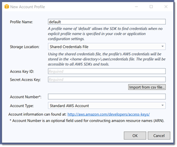

# Module 1: Setup the AWS tools and user credentials

The steps in this module will walk you through setting up the [AWS Toolkit for Visual Studio](https://aws.amazon.com/visualstudio/) (Windows only) and the AWS extensions for working with [AWS Lambda](https://aws.amazon.com/lambda/) and [Amazon Elastic Container Service](https://aws.amazon.com/ecs/) with the dotnet CLI (on Windows, macOS, and Linux). Finally you will create an [Identity and Access Management (IAM)](https://aws.amazon.com/iam/) user in your account with programmatic credentials, and configure a local credential profile containing the AWS access and secret keys generated for the user that will then be used by the AWS tools.

> ***Note: You may skip this module and proceed directly to module 2 if you already have the tools installed and have a credential profile for an IAM user (with at least AWS Power User permissions) on your machine, .***

## Step 1: **(Visual Studio on Windows users only)** Install the AWS Toolkit for Visual Studio

In this step you will install the AWS Toolkit for Visual Studio on Windows. If you are using macOS or Linux, or are on Windows and do not wish to use Visual Studio, you can skip this step.

1. Start Visual Studio and select *Extensions > Manage Extensions* from the main menu.
1. In the extensions dialog that opens, select *Online* in the left-hand panel.
1. Enter the text **AWS** in the Search field in the upper right of the dialog.
1. In the find results select the entry that reads **AWS Toolkit for Visual Studio 2017 and 2019**.
1. Click the **Download** button. The extensions dialog will display a message stating that the extension will be installed when Visual Studio is restarted.
1. Close the dialog and exit Visual Studio. The *VSIX Installer* will start when when Visual Studio closes. Click the **Modify** button in the installer window to start the installation of the toolkit.
1. Click the *Close* button to exit the installer when it completes.

The AWS Toolkit for Visual Studio is now installed and will be available for use when Visual Studio is next started.

## Step 2: Install command line tools

In this step you will install the [AWS extensions for the dotnet CLI](https://github.com/aws/aws-extensions-for-dotnet-cli) to support working with AWS Lambda and Amazon Elastic Container Service from the command line. This step is relevant for all users regardless of operating system platform.

1. Open a command line shell in your chosen operating system.
1. Install the AWS dotnet CLI extension for AWS Lambda by running the command

    ```bash
    dotnet tool install -g Amazon.Lambda.Tools
    ```

1. Install the AWS dotnet CLI extension for Amazon Elastic Container Service by running the command

    ```bash
    dotnet tool install -g Amazon.ECS.Tools
    ```

You have now completed tool setup and can move onto the next step to configure a credential profile to use with the tools (both command line and Visual Studio).

## Step 3: Create an IAM user with programmatic credentials and console sign-in

AWS strongly recommends creating an Identity and Access Management (IAM) user for use with the AWS development tools and to *not* use your root account credentials. Follow the steps below to provision a new user, and generate programmatic credentials (access and secret key) and console login link with password, for use with the tools.

1. Log into the AWS Management Console.
1. At the Console Home page, enter the text *IAM* in the **Find Services** field.
1. Click the resulting selection to jump to the IAM console home.
1. Select **Users** in the left-hand panel.
1. Click *Add User*.
1. Give the new user a name and check both *Programmatic access* and *AWS Management Console access* for **Access type**. You can specify a console login password of your own choice if you wish, or have a password generated for you, and can also elect to require a password reset on initial login if you so choose.
1. Click *Next: Permissions*.
1. Click *Attach existing policies directly*.
1. In the **Search** field enter the text *admin*.
1. Check *AdministratorAccess* in the resulting list.

    > **Note:** although more restrictive policies, scoped to specific services, service APIs and resources is always a best practice, for this workshop you need to create a user with administrative access. The application code we will be deploying will run under more tightly scoped roles that will be created later. This specific user we are creating is for your local development purposes only.

1. Click *Next: Tags*.
1. You may add tags to the new user if you wish, they are not required for this guide.
1. Click *Next: Review*.
1. Review the selections to ensure the **AWS access type** is set to *Administrator access - with an access key* and the **Managed policy** *PowerUserAccess* is selected.
1. Click *Create user*.
1. **Important**. On the next screen click the **Download .csv** button to download a csv-formatted file containing the user's generated credentials to your machine. You will use these to create a credential profile for the user for use with the tools. You can also find the url to the console login for your new user displayed on this page. We recommend you sign into the console at this time. The password for the user is contained in the csv file you just downloaded.

    > Note: this is the ***only*** time you will be able to obtain the secret access key for this user so do not skip downloading the file!
1. Once you have downloaded the csv file, or made a note of the generated credentials (access *and* secret key) click *Close* to return to the *Users* home page in the IAM console.

You have now created a new user in your account for use with the tools and can proceed to the next step to configure the tools to use this user's credentials.

## Step 4: Create a credential profile for the user

With the AWS tools installed and a new user created in your account with programmatic credentials this step walks you through how to setup a credential profile representing the user that can be used by the tools. How you do this depends upon your chosen tool so instructions for Visual Studio and the command line are provided below.

### Setting up a credential profile in Visual Studio

1. Start Visual Studio. If this is the first time launching Visual Studio after installing the AWS toolkit and no other credential profiles exist on your system it will display the *AWS Getting Started* view inviting you to add credentials.

    

    > Note: If the *AWS Getting Started* view does not display (for whatever reason) you can still add a new credential profile using the *AWS Explorer* window, as follows:

    1. Open the *AWS Explorer* window by selecting *View > AWS Explorer* from the main menu.
    1. Click the **New account profile** button to the right of the **Profile** field (the first button in the set of three).
    1. The *New Account Profile* dialog is displayed, as shown:

        
    1. You can now resume with the instructions below which apply to either window.

1. Enter a name for the credential profile. This can be the same name as the IAM user you created or you can use **default**, as suggested in the dialog. If you use the name *default* the tools will locate and use it automatically if no other credential profile is specified.
    > Note: if you elect to use a custom name you will need to specify the profile name when using the dotnet CLI extensions in later modules using the *--profile* option. All instructions and screenshots in this guide assume you have named your credential profile *default*.
1. Click the *Import from csv file* button, navigate to the csv file you downloaded in the previous step and select it before clicking *OK* to close the dialog.
1. The access and secret access keys for the user will be loaded into the view.
1. You may leave the **Account Number** blank if you wish. For all standard public AWS accounts leave the **Account Type** field at *Standard AWS Account*. If you are using an AWS GovCloud account, or are in the AWS China region, select the correct account type in the field.
1. Click *Save and close* button (*OK* in the *New Account Profile* window) to close the view. Your new credential profile will be preselected in the *AWS Explorer* window ready for use.

***You have now completed this module and can move onto module 2.***

### Setting up a credential profile using a text editor

Follow these steps to create a credential profile using a text editor of your choice.

1. Start your text editor and create (or open if it already exists) the credentials file located in the **.aws** subfolder beneath your user's home folder. On Windows this will be the *%USERPROFILE%\\.aws\\credentials* file. On macOS or Linux this is the *~/.aws/credentials* file.
1. Enter the text as shown below, pasting in the access and secret access key values from the csv file you downloaded in the previous step.

    ```bash
    [default]
    aws_access_key_id=ACCESS-KEY-HERE
    aws_secret_access_key=SECRET-ACCESS-KEY-HERE
    ```

    The text enclosed in [] is the profile name (*default* in the example above). You can change this if you wish.

    > Note: if you elect to use a custom profile name you will need to specify the profile name when using the dotnet CLI extensions in later modules using the *--profile* option.

1. Save the file and exit the text editor.

***You have now completed this module and can move onto module 2.***

### Setting up a credential profile at the command line

If you have either the [AWS Tools for PowerShell](https://aws.amazon.com/powershell/) or the [AWS CLI](https://aws.amazon.com/cli/) installed you can follow these steps to set up your credential profile.

#### Using the AWS Tools for PowerShell

1. Open a PowerShell command prompt.
1. If you have the [AWSPowerShell](https://www.powershellgallery.com/packages/AWSPowerShell/) or [AWSPowerShell.NetCore](https://www.powershellgallery.com/packages/AWSPowerShell.NetCore/) modules installed, first import the relevant module with the command

    > Note: to install either module from the PowerShell Gallery use the Install-Module command.

    ```powershell
    # Use this module and command for Windows PowerShell v2-v5.1
    PS C:\> Import-Module AWSPowerShell
    # Use this module and command for AWSPowerShell.NetCore on Windows (PowerShell v3-v5.1),
    # or PowerShell 6+ on Windows, Linux, or macOS
    PS C:\> Import-Module AWSPowerShell.NetCore
    ```

    > Note: if you are using the [new preview of the tools](https://aws.amazon.com/blogs/aws/preview-release-of-the-new-aws-tools-for-powershell/), you do not need to import a module first.

1. Open the csv file in a text editor.
1. Run the following command, substituting the access and secret access key values from the csv file:

    ```powershell
    PS C:\> Set-AWSCredential -AccessKey ACCESS-KEY-HERE -SecretKey SECRET-ACCESS-KEY-HERE -StoreAs "default"
    ```

    > Note: the value supplied to the -StoreAs parameter (*default*) is the profile name. You may change this if you wish. If you elect to use a custom name you will need to specify the profile name when using the dotnet CLI extensions in later modules using the *--profile* option.

    > Note: on Windows the command shown above will write the credential profile to the encrypted credential store held in %USERPROFILE%\\AppData\\Local\\AWSToolkit\\RegisteredAccounts.json. To have the profile written to the plain text shared credentials file in %USERPROFILE%\\.aws\\credentials, add the -ProfileLocation parameter with the location of the shared credentials file.

#### Using the AWS CLI

1. Open a command shell and run the command

    ```bash
    aws configure
    ```

1. Respond to the prompts, supplying the access key and secret access key values from the csv file you downloaded previously. You can accept the default profile name or change it. When prompted to select a default region, enter the region you will be deploying this sample to (for convenience).

***You have now completed this module and can move onto [module 2](./Module2.md).***
