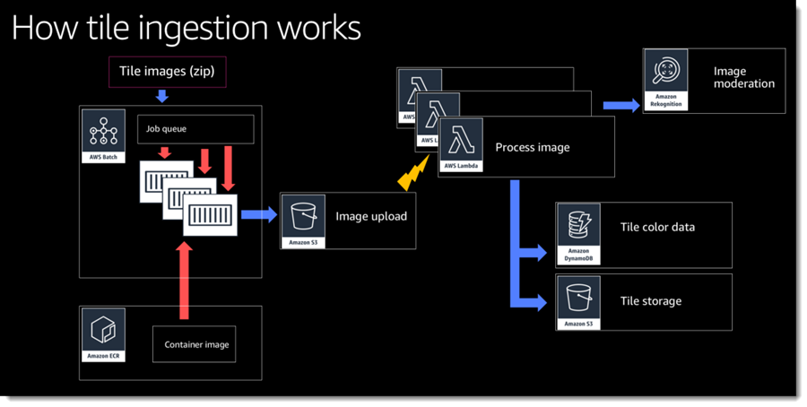
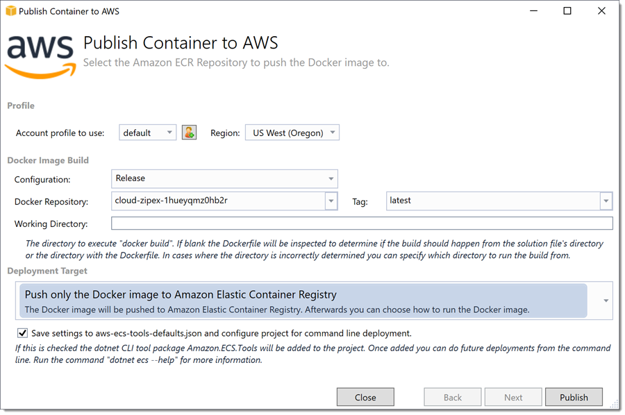
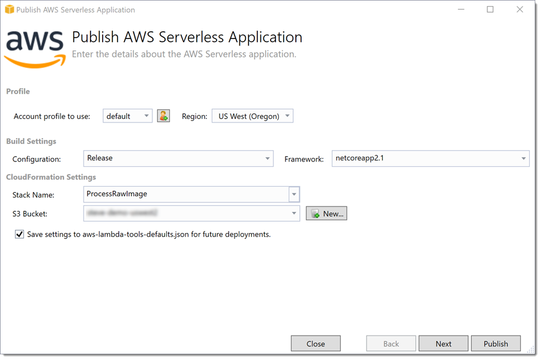
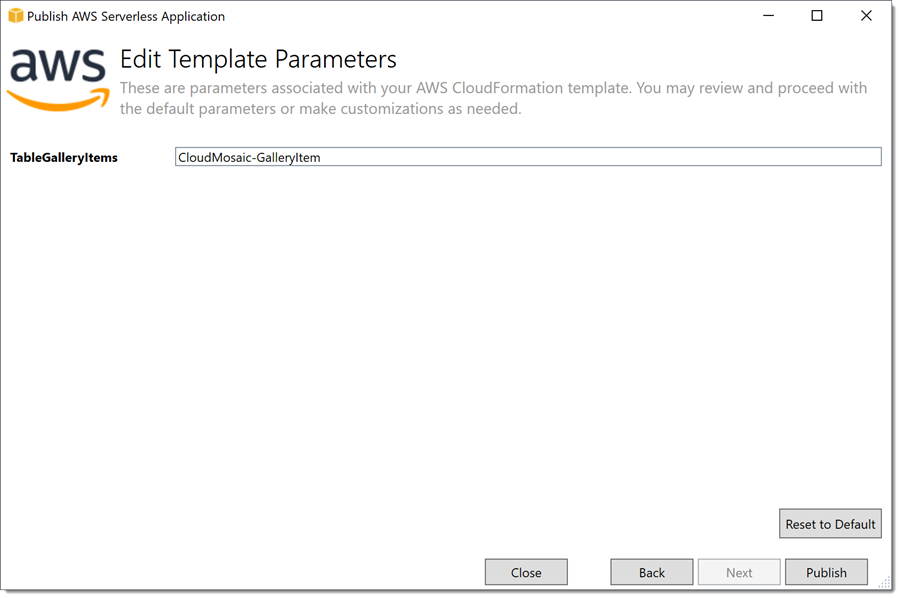
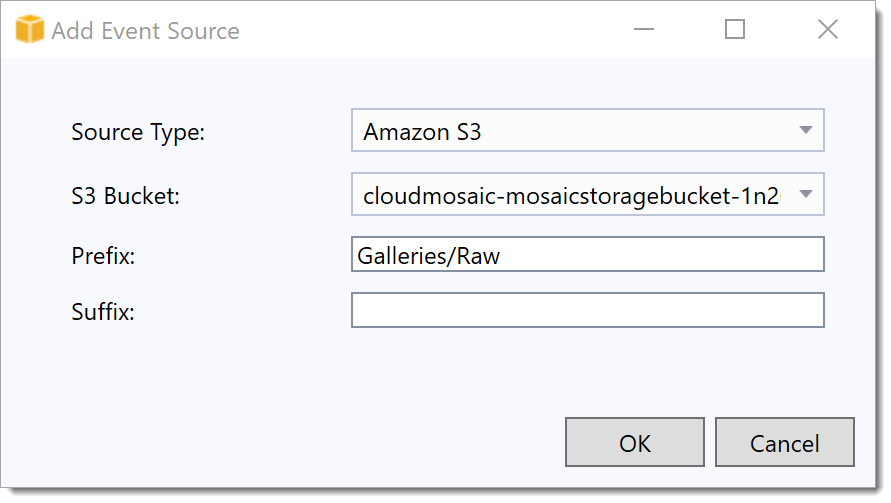
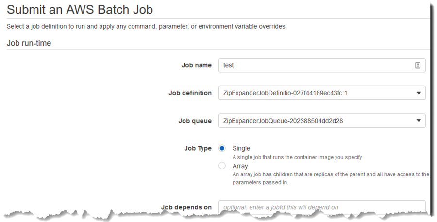
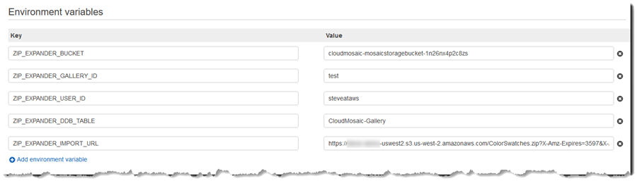

# Module 3: Tile gallery ingestion subsystem

The steps in this module walk you through deploying and testing the tile ingestion subsystem. This subsystem enables the user to supply a zip file containing images to be used as tiles when creating a mosaic. An AWS Batch job expands the zip file and uploads each image in the file to an Amazon S3 bucket (created as part of module 2). An AWS Lambda function is triggered by each upload to validate and process the image files to make them suitable to use as tiles in a mosaic.

The architecture for this subsystem is shown below.



* Tile ingestion is not a time-critical task and using AWS Batch gives us flexibility to choose appropriate compute resources, for example:
  * We could use spot instances to do the work when compute becomes available at a cost we define.
  * We could enable paying customers to get access to more powerful (and on-demand) compute resources.
  * The batch process starts when work is available in the queue, does what's needed, and then closes down again. There is no charge when the code is not actually running.
* The AWS Lambda function also does not run until objects are available to process, so there is no idle time cost.

The projects to be used in this module can be found under the *GalleryGenerator* subfolder.

## Step 1: Deploy the ZipExpanderConsole project to Elastic Container Registry

The *ZipExpanderConsole* project in the solution is a simple .NET Core console application that takes a URL to a zip file containing images to be used in a tile gallery. The job unpacks the zip file and uploads each image it contains to an Amazon S3 bucket.

> Note: The job uploads the individual images to the bucket using a 'Galleries/Raw' key prefix. The bucket to be used, created by the AWS CloudFormation template you deployed in module 2, has the name pattern *stackname*-mosaicstoragebucket-*RANDOM* in your account (for example, *cloudmosaic-mosaicstoragebucket-mpxc9qo7wja9*).

### Deploying the ZipExpander project using Visual Studio

1. Right-click on the *ZipExpanderConsole* project and select *Publish container to AWS*.
1. Select the credentials to be used and the region you selected when deploying the CloudFormation template in module 2.
1. Select the repository to deploy to - it has the name pattern cloud-zipex-*RANDOM*.
1. Leave tag blank, or enter **latest**
1. Deployment target should be set to *Push only the Docker image...*

    

1. Click Publish to push the image and exit the wizard.

### Deploying the ZipExpander project using the dotnet CLI

1. Open a command shell and cd into the *./Application/GalleryGenerator/ZipExpanderConsole* folder.
1. You should have already installed the Amazon.ECS.Tools global tool package as part of module 1 but if not, run the following command to install:

    ```bash
    dotnet tool install -g Amazon.ECS.Tools
    ```

1. Edit the *aws-ecs-tools-defaults.json* file in the project to reference the correct tag to identify the repository and other resources for the deployment, for example:

    ```json
    {
        "region" : "us-west-2",
        "profile" : "default",
        "configuration" : "Release",
        "tag" : "cloud-zipex-1hueyqmz0hb2r:latest",
        "task-definition-name" : "",
        "task-cpu"             : "512",
        "task-memory"          : "1024",
        "task-definition-task-role" : "",
        "task-execution-role" : "ecsTaskExecutionRole",
        "vstoolkit-deployment-mode" : "PushOnly",
        "docker-build-working-dir"  : ""
    }
    ```

1. Save the file and exit to the command shell.
1. Run the following command to perform the deployment:

    ```bash
    dotnet ecs push-image
    ```

## Step 2: Deploy the ProcessRawImage Lambda Function project

The *ProcessRawImage* project is an AWS Lambda function, written in C#, to accompany the batch job. It is invoked when an object is created or updated in an Amazon S3 bucket - as a result of the zip expander running - under a specific key path. The Lambda function uses Amazon Rekognition to check for moderation labels and if there are any, it abandons further processing of the image. If the image passes moderation checks the function proceeds to determine an average color before resizing and storing as a tile belonging to the user's gallery.

### Deploying the ProcessRawImage project using Visual Studio

1. Right-click on the ProcessRawImage project, select *Publish to AWS Lambda*
    1. Choose an S3 bucket to contain the uploaded bundle (must be in same region as the deployment is targeting). You can create a new bucket if you wish or use an existing one.
    1. Leave all other settings on the first page at their defaults

    

    1. Click **Next**
    1. Make sure to set the *TableGalleryItems* parameter to *CloudMosaic-GalleryItem* to match template naming of ***StackName*-GalleryItem** (the *StackName* value is the name of the stack you created using the CloudFormation template in module 2).

    

    1. Click **Publish**

When the deployment has completed and status reads **CREATE-COMPLETE**, the next step is to wire up an S3 event notification to the newly deployed Lambda function.

1. In Visual Studio refresh the AWS Explorer view and the expand the *AWS Lambda* tree. Select the *ProcessRawImage* function and double-click it to open the function view.
1. In the function view click the *Event Sources* tab
1. Click **Add**
1. Set *Source Type* to **Amazon S3**
1. For *S3 Bucket* choose the bucket created by the template (name will be similar to *cloudmosaic-mosaicstoragebucket-RANDOM*)
1. Enter **Galleries/Raw** in the *Prefix* field.

    

1. Click OK

### Deploying the ProcessRawImage project using the dotnet CLI

1. Open a command shell and cd into the *./Application/GalleryGenerator/ProcessRawImage* folder.
1. You should have already installed the Amazon.Lambda.Tools global tool package as part of module 1 but if not, run the following command to install:

    ```bash
    dotnet tool install -g Amazon.Lambda.Tools
    ```

1. Edit the *aws-lambda-tools-defaults.json* file in the project to set the correct parameters and Amazon S3 bucket for the deployment, for example:

    ```json
    {
        "profile"     : "default",
        "region"      : "us-west-2",
        "configuration" : "Release",
        "framework"     : "netcoreapp2.1",
        "s3-prefix"     : "ProcessRawImage/",
        "template"      : "serverless.template",
        "template-parameters" : "\"TableGalleryItems\"=\"CloudMosaic-GalleryItem\"",
        "s3-bucket"           : "YOUR-BUCKET-NAME-HERE",
        "stack-name"          : "ProcessRawImage"
    }
    ```

    > Note: the S3 bucket must be in the same region as the Lambda function you are creating.

1. Save the file and exit to the command shell.
1. Run the following command to perform the deployment:

    ```bash
    dotnet lambda deploy-serverless
    ```

## Step 3: Manually run a Batch job to create a tile gallery

In this step you will simulate what the web application will do when a logged-in user uploads a zip file containing images to create a tile gallery, to verify your deployments.

To support these steps the repository contains a small collection of solid color swatches, *./TileGalleries/ColorSwatches.zip*, that you can use to create a tile gallery. If you have your own zip file of images you can also use that instead.

1. Open the AWS Console open the Batch console.
    * Select *Services* and enter the text **Batch** into the search field.
    * Select *Batch* from the results.
1. Click **Create job**.
1. Give the job a name.
1. For *Job definition* select the template-created resource (name pattern *ZipExpanderJobDefinition-RANDOM*)
1. For *Job queue* select the template-created resource (name pattern *ZipExpanderJobQueue-RANDOM*)

    

1. Scroll down and enter a set of environment variables to configure the job

    > Note: these variables will be set from the web UI in the fully deployed application, we need to set them here as we are queuing the job manually for test purposes.

    1. ZIP_EXPANDER_BUCKET = *cloudmosaic-mosaicstoragebucket-RANDOM* from template
    1. ZIP_EXPANDER_GALLERY_ID = *choose-a-gallery-name*
    1. ZIP_EXPANDER_USER_ID = *your-intended-user-id*
        > Note: choose the id you'll use eventually in the front-end app to have the gallery be available to that user
    1. ZIP_EXPANDER_DDB_TABLE = *CloudMosaic-Gallery* (match template: *StackName*-Gallery*)
        > Note: the DynamoDB table name is case sensitive, so be sure to match the casing of the stack name used in the pre-requisites section.
    1. ZIP_EXPANDER_IMPORT_URL = **url to zip file somewhere**

        > Note: to generate a url you can use the Visual Studio toolkit to upload a file to an S3 bucket, as follows:

        * Double click the bucket in the AWS Explorer to open it
        * Drag a zip file containing images to be used as tiles and drop it on the bucket view. Click **OK** in the dialog box that is displayed to start the upload.
        * Once the upload completes right click on the new object and select **Create Pre-Signed URL**.
        * In the dialog that is displayed, leave the settings at their defaults and click **Generate**.
        * Copy the url that is displayed then close the dialog.
        * Paste the url into the environment variable value for the batch job.

    

1. Click **Submit job**

> Note: there is no 'done' notification from either the Batch job or the Lambda function. Wait until the job is listed under *succeeded* on the job console before proceeding to satisfy yourself that the ingestion process is working correctly.

***You have now completed this module and can move onto the next.***
