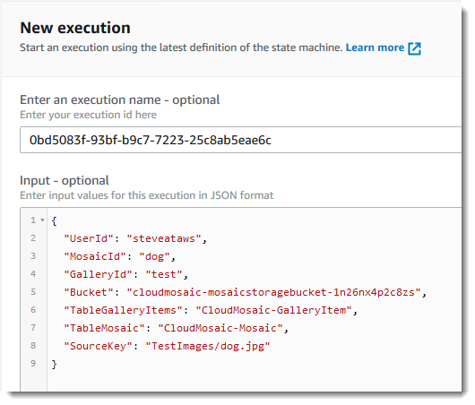

# Module 4: Image to Mosaic Workflow

Projects and other files for the Mosaic Workflow subsystem can be found under the *MosaicStepFunctions* solution folder.

* The *serverless.template* file defines the Lambda functions making up the state machine (as tasks) and also the state machine itself, however the definition entry for the state machine is intentionally blank. The code reference for each Lambda function is a relative reference to the subproject containing the function handler.
* The Lambda functions used in the state machine are written in C# and F# to demonstrate the tooling's ability to package and deploy Lambda functions written in different languages.
* The state machine definition is contained in the file named *state-machine.json*
* The .NET tooling (Visual Studio toolkit or dotnet CLI extensions for Lambda) inject the state machine file into the *serverless.template* file at deploy time (they update a copy of the file, not the original). They also fix up the relative project references for you.
* In the *aws-lambda-tools-defaults.json* file the *template-substitutions* entry uses a json path notation to identify the point in the serverless.template file at which the state machine json definition content should be injected during deployment.

## Step 1: Deploy the state machine and related Lambda functions

The Lambda functions are contained in individual projects, so you cannot use the right-click gesture in Visual Studio to deploy them as a single serverless application. Clicking on the *serverless.template* file at the root of the *MosaicStepFunctions* solution folder will show no actions related to AWS deployments. Instead you will use the dotnet CLI extensions for Lambda from the command line.

### Step 1a: Open the project location and install tools

1. Open a command shell and change directory to the *MosaicStepFunctions* folder of the sample application
1. If you do not already have the dotnet CLI extensions for Lambda installed (from module 1) execute the command

    ```bash
    dotnet tool install -g Amazon.Lambda.Tools
    ```

### Step 1b: (Optional) Publish shared dependencies as a Lambda layer

If you wish you can gather common binary dependencies of the Lambda functions (eg the [SixLabors](https://www.nuget.org/packages/SixLabors.ImageSharp/) image processing library) into a Lambda layer that is deployed separately from the functions themselves. This can improve cold start time of the functions as Lambda is pulling a smaller deployment bundle and also improves deployment time due to smaller function bundles. Deeper discussion of the advantages of using layers can be found in this [blog](https://aws.amazon.com/blogs/developer/aws-lambda-layers-with-net-core/) post.

> Note: You do not need to use layers to deploy this part of the application. If you do not want to make use of layers, proceed to **step 1c** below to deploy the state machine as-is.

To use layers you first create a manifest file of the dependencies to be included in the layer. We have done this for you and the file, named *MosaicLayers.xml*, can be found in the *MosaicStepFunctions* folder you opened in the step above. Once the layer is deployed you next update the function definitions in the *serverless.template* file to reference the layer using its ARN, which is output by the layer publish process.

1. From the command line shell you opened above, build and deploy the layer using the following command. You can change the layer name if you wish but *--layer-type* must be set to **runtime-package-store**.

    > Note: you can view help for the command by running `dotnet lambda publish-layer help`

    ```bash
    dotnet lambda publish-layer --layer-type runtime-package-store --layer-name mosaiclayer --package-manifest ./MosaicLayers.xml
    ```

    > Note 1: the command will prompt you to supply the name of an Amazon S3 bucket to which it will upload the layer bundle. The bucket must exist in the same region as the deployed Lambda functions and layer.\
    > Note 2: the command example above assumes you used the name *default* for the credential profile you created in module 1. If you used a different name, add the *--profile **profilename*** option, for example *--profile myworkshopprofile*.

1. When the publish command completes it will output the ARN of the new layer. For example:

    ```text
    Layer publish with arn arn:aws:lambda:us-west-2:123456789012:layer:mosaiclayer:1
    ```

    Copy the ARN to the clipboard ready for the next step.

1. Open the *serverless.template* file in Visual Studio and expand the definition of the first Lambda function. You can use the support for editing json-format CloudFormation templates provided by the toolkit to add a *Layers* element (enter a new line, then press Ctrl+Space to see valid child elements), or add by hand. Add the *Layers* element after the *Code* element. The *Layers* entry has an array of strings as children. Each child is the ARN of the layer to be referenced by the function when it executes. After editing, the function should look similar to this:

    ```json
    "Code" : {
        ...
    },
    "Layers": [
        "arn:aws:lambda:us-west-2:123456789012:layer:mosaiclayer:1"
    ]
    ```

1. Copy the *Layers* entry to the other Lambda functions in the template that you want to also use the layer (for simplicity you could apply the change to all of the functions).

    > Note: If you change any of the *RenderMosaicFunction*-based functions (for small, medium or large renders) to add layer support **be sure to edit them all to match**. Any error will occur when the functions are executed if their is a mismatch - all three entries refer to the same function, just with different memory size values.

1. Save the changes to the template and return to the command line shell for the next step.

### Step 1c: Deploy the State Machine and Lambda functions

To deploy the step functions (with or without layer support):

1. Run the command

    ```bash
    dotnet lambda deploy-serverless
    ````

    > Note: the command example above assumes you used the name *default* for the credential profile you created in module 1. If you used a different name, add the *--profile profilename* option, for example *--profile myworkshopprofile*.

1. Provide the name of a bucket (must be in the same region as the deployment target) to which the bundle holding our built and packaged Lambda functions will be uploaded.

## Step 2: Run the state machine

1. Using Visual Studio or the AWS Console, open the bucket created by the CloudFormation stack you deployed in module 2. It will have a name in the format **stackname*-mosaicstoragebucket-*RANDOM* (for example, *cloudmosaic-mosaicstoragebucket-mpxc9qo7wja9*)*.
1. Upload an image file to a path in the bucket.
    > Note: **do not** put the file in the Galleries/Raw path in the bucket, instead use a new top-level key eg *TestImages*. To do this using Visual Studio ensure you are viewing the root contents of the bucket and then right click and select **Create folder** (or use the view's toolbar button). Fill in the key prefix name ("folders" in an S3 bucket are simply object key prefixes, S3 is not a file system!) and click **OK**. Double-click the resulting 'folder' and then drag and drop an image file to the bucket.
1. Open the AWS Management Console, navigate to the Step Functions dashboard.
    * Select *Services* and enter the text **Step** into the search field.
    * Select *Step Functions* from the results.
1. Click the name of the state machine you just deployed (the name will be in the ARN shown by the cli tool output in the previous section).
1. Click **Start execution**
1. Delete the sample json input and paste in the json snippet below, edited to suit:

    ```json
    {
        "UserId": "USERID-HERE",
        "MosaicId": "MOSAIC-ID-HERE",
        "GalleryId": "GALLERY-ID-HERE",
        "Bucket": "cloudmosaic-mosaicstoragebucket-RANDOM",
        "TableGalleryItems": "CloudMosaic-GalleryItem",
        "TableMosaic": "CloudMosaic-Mosaic",
        "SourceKey": "TestImages/IMAGE-FILENAME-HERE"
    }
    ```

    1. Edit **UserId** to match the one you used when creating the tile gallery in module 3
    1. Edit **GalleryId** to match the one you used when creating the tile gallery in module 3
    1. Enter a name for the mosaic in **MosaicId**
    1. Edit **Bucket** to be the bucket name you uploaded the image to
    1. Edit **SourceKey** to match the key of the file you uploaded to the bucket

    

1. Click **Start execution**

When the step functions complete you can open the S3 bucket in Visual Studio or the AWS Console to view the created artifacts. The output mosaics will have been placed into the *Mosaic/userid/mosaicid/* path in the bucket.

***You have now completed this module and can move onto the next.***
