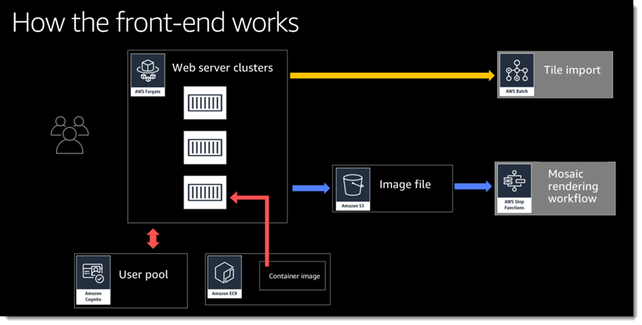
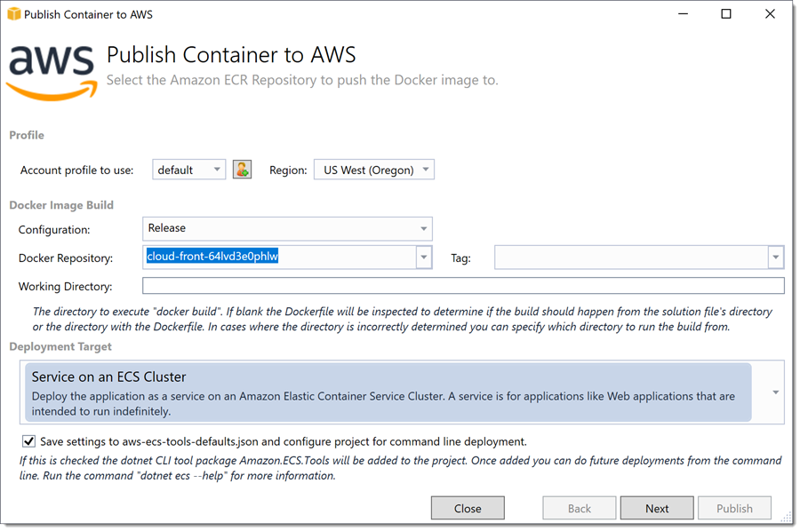
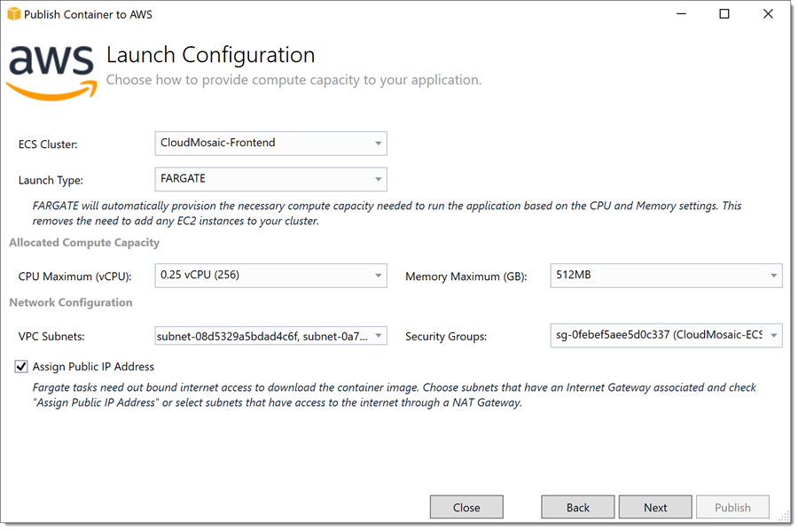
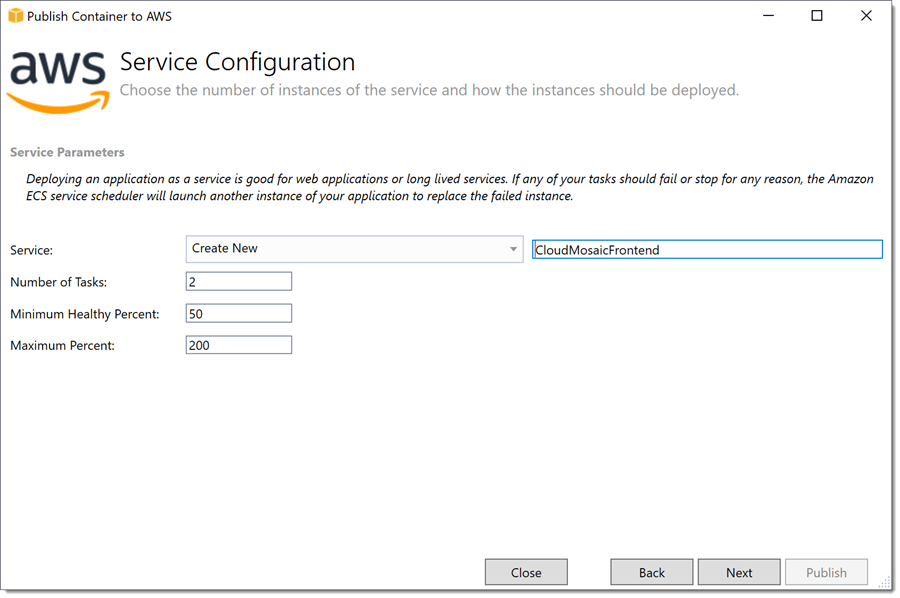
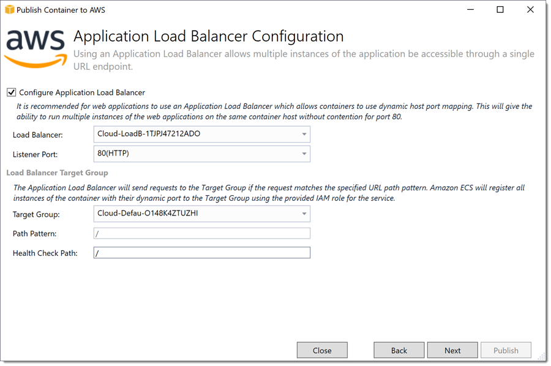
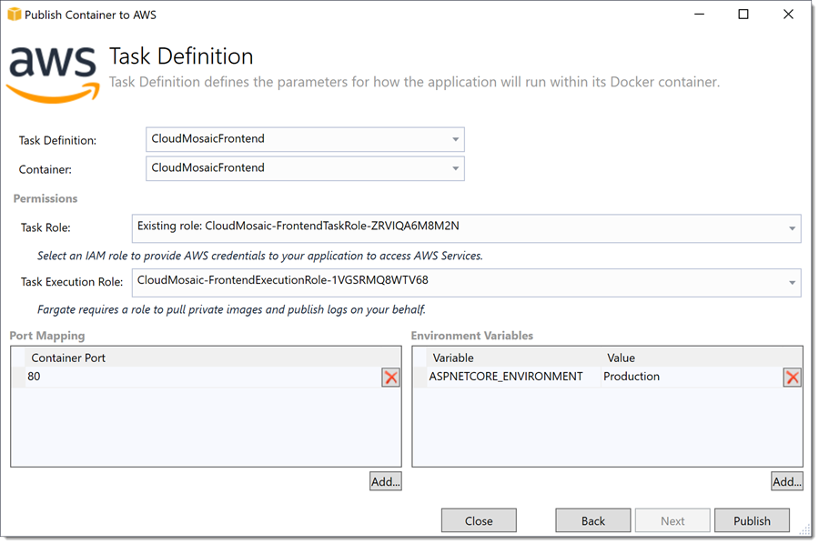
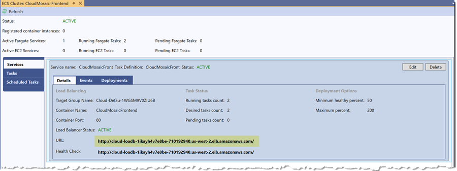
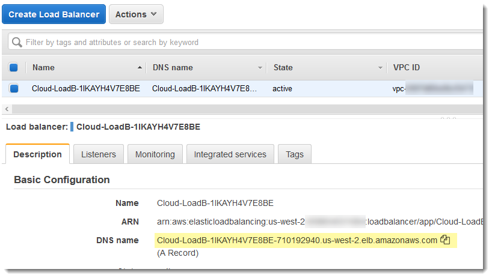

# Module 5: Deploy web application front-end on AWS Fargate

In this module you will deploy the web application front-end using AWS Fargate (note that we can run the front-end application either locally or after deployment to Fargate).

The web front-end demonstrates the following integration with AWS:

* using the [Amazon.Extensions.Configuration.SystemsManager](https://github.com/aws/aws-dotnet-extensions-configuration) NuGet package to retrieve runtime configuration settings from Parameter Store instead of appsettings.json.
* replacing the default SQL Server identity setup with a Cognito User Pool and use of the [Amazon.AspNetCore.Identity.Cognito](https://github.com/aws/aws-aspnet-cognito-identity-provider) NuGet package to coordinate user registration and login activities.
* persisting the anti-forgery token injected into ASP.NET Core views to AWS Systems Manager's Parameter Store using the[Amazon.AspNetCore.DataProtection.SSM](https://github.com/aws/aws-ssm-data-protection-provider-for-aspnet) NuGet package.

The architecture for the web front-end can be seen below.



The project for the web front-end can be found in the *UI* solution folder.

## Deploy the web front-end project using Visual Studio

1. Right-click on the project and select *Publish container to AWS*.
1. On the starting page of the wizard ensure the credential profile and region selections are correct and match what has been used to deploy the other subsystems above.
1. For *Docker Repository* select the repository created via the CloudFormation template in the pre-requisites section (name pattern *cloud-front-RANDOM*)
    1. For Tag enter **latest** (or leave blank)
    1. For *Deployment Target*, **Service on an ECS Cluster** should be selected.
  
1. Click **Next**.
1. On the *Launch Configuration* page:
    1. Open **VPC Subnets** and select at least 2 subnets from the VPC created for you by the CloudFormation template you deployed in module 2. If the wizard has selected any subnets from your default VPC, uncheck them.
    1. Open **Security Groups** and select the security group for the web front end (also created by the template in module 2). It will have a name similar to *CloudMosaic-ECSSecurityGroup-RANDOM*.
1. Leave the other settings at their default values.
  
1. Click **Next**.
1. Leave the default values unchanged on the *Service Configuration* page and click **Next**.
  
1. On *Application Load Balancer Configuration*:
    1. Check **Configure Application Load Balancer**.
    1. For *Load Balancer* select the one created by the pre-requisites stack (name pattern *Cloud-LoadB-RANDOM*).
    1. For *Listener Port* select **80 (HTTP)**.
    1. For *Target Group* select the one created by the pre-requisites stack (name pattern *Cloud-Defau-RANDOM*).
  
1. Click **Next**.
1. On *Task Definition*:
    1. For *Task Definition* select *Create new* and accept the default name, **CloudMosaicFrontend**.
    1. *Container* should be set to **CloudMosaicFrontend**.
    1. *Task Role* should be set to **Existing role: CloudMosaic-FrontendTaskRole-*RANDOM***.
    1. *Task Execution Role* should be set to **CloudMosaic-FrontendExecutionRole-*RANDOM***.
        > Note: both of these roles were created as part of the CloudFormation stack you deployed in module 2.
  
1. Click **Publish**.

After the wizard completes the toolkit will open a view onto the cluster. Click **Refresh** in the view's toolbar until *Running tasks* matches the number requested in the wizard (defaults to 2) and a url to the application is shown. You can now access the running application's home page by clicking the link shown in the services tab, for example:

  

## Deploying the web front-end project using the dotnet CLI

The global Amazon.ECS.Tools package was installed in module 3 and we will re-use it's commands here to publish our web application to AWS Fargate.

1. Open a command shell and cd to the *./Application/UI/CloudMosaic.FrontEnd* folder.
1. Edit the *aws-ecs-tools-defaults.json* file to set the resources to be referenced during deployment. These resources were created by the CloudFormation stack you deployed to in module 2. For example:

    ```json
    {
        "region" : "us-west-2",
        "profile" : "default",
        "configuration" : "Release",
        "tag"           : "cloud-front-64lvd3e0phlw:latest",
        "cluster"       : "CloudMosaic-Frontend",
        "launch-type"   : "FARGATE",
        "launch-subnets" : "subnet-08d5329a5bdad4c6f,subnet-0a70b7213f2ddc1ed",
        "launch-security-groups" : "sg-0febef5aee5d0c337",
        "assign-public-ip"       : true,
        "task-definition-name"   : "CloudMosaicFrontend",
        "task-cpu"               : "256",
        "task-memory"            : "512",
        "task-definition-task-role" : "arn:aws:iam::939934531084:role/CloudMosaic-FrontendTaskRole-ZRVIQA6M8M2N",
        "task-execution-role"       : "CloudMosaic-FrontendExecutionRole-1VGSRMQ8WTV68",
        "container-name"            : "CloudMosaicFrontend",
        "container-port-mapping"    : "80:80",
        "container-environment-variables" : "\"ASPNETCORE_ENVIRONMENT\"=\"Production\"",
        "skip-image-push"                 : false,
        "cluster-service"                 : "CloudMosaicFrontend",
        "desired-count"                   : 2,
        "deployment-minimum-healthy-percent" : 50,
        "deployment-maximum-percent"         : 200,
        "elb-target-group"                   : "arn:aws:elasticloadbalancing:us-west-2:939934531084:targetgroup/Cloud-Defau-O148K4ZTUZHI/c3b71a369984527b",
        "elb-container-port"                 : 80,
        "docker-build-options"               : "--pull",
        "vstoolkit-deployment-mode"          : "DeployService",
        "docker-build-working-dir"           : ""
    }
    ```

1. Save the file and exit the editor back to the command shell.
1. Run the following command to deploy the web application:

    ```bash
    dotnet ecs deploy-service
    ```

1. When the command completes, in the AWS Management Console navigate to the EC2 homepage.
    * Select *Services* and enter the text **EC2** into the search field.
    * Select *EC2* from the results.
1. Under *Load Balancing* in the left-hand navigation pane select **Load Balancers**.
1. Select the load balancer for the application (it will have a name with pattern *Cloud-LoadB-RANDOM*).
1. In the *Basic Configuration* data for the selected load balancer, copy the DNS name. This is the URL to the deployed application.

    

1. Open a web browser and paste the copied DNS link to access the deployed application's home page.

***You have now completed this module and can move onto the next.***
